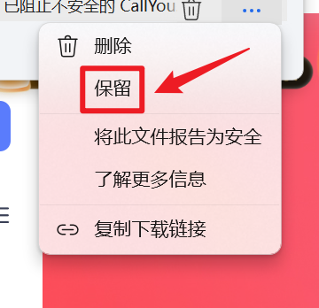
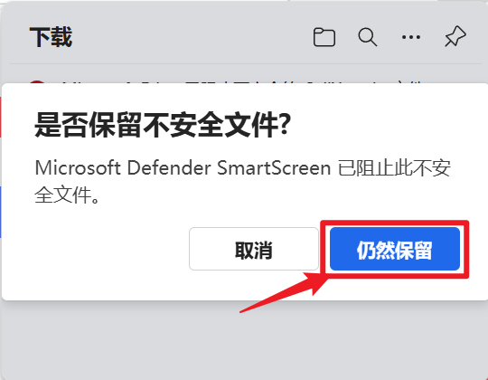
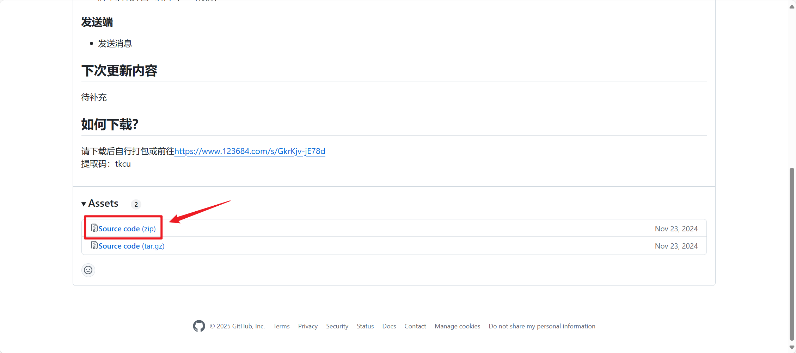
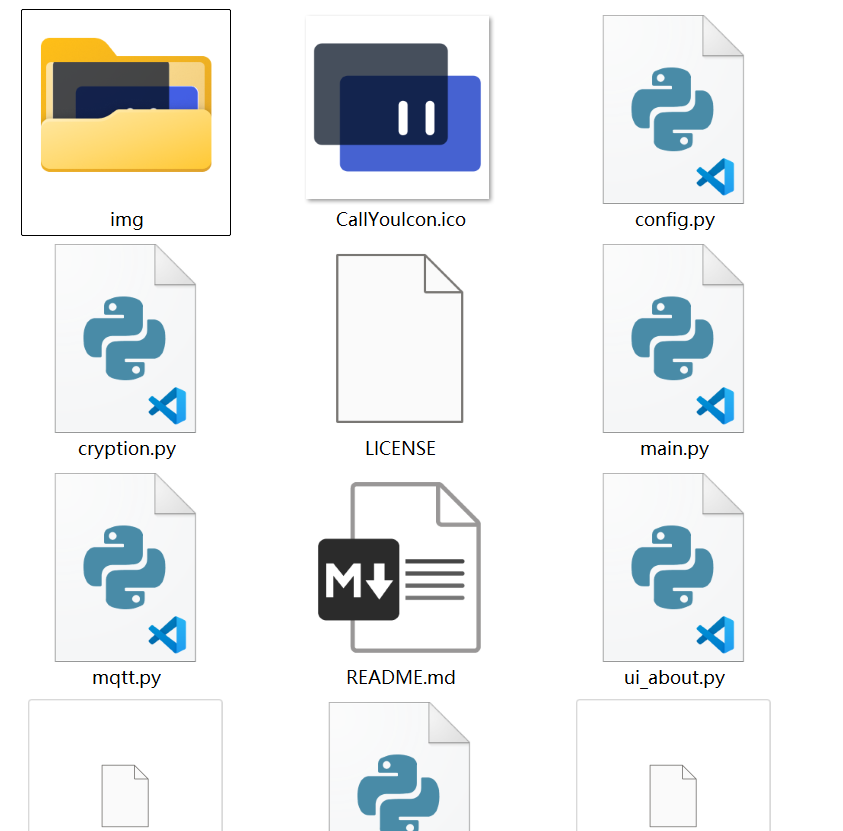

# 如何下载使用？

有以下两个方案：

---

## 方案一：通过123云盘下载

**Step1.** 前往 [123云盘](https://www.123684.com/s/GkrKjv-jE78d) 下载已打包文件，提取码：tkcu。

**Step2.** 信任下载的文件。（该软件保证无毒，可以自行检查源代码）






**Step3.** 用解压缩软件将下载的`CallYou.zip`文件解压到一个 **空文件夹** 。


**Step4.** 在软件根目录下新建文件`config.json`，内容参见 [如何配置？](./config.md) ，接收端示例如下（请务必不要照抄！！！）：

```json
{
    "mode": "r",
    "mqtt": {
        "broker": "broker.emqx.io",
        "port": 1883,
        "topic": "tkcallyou/mqtt/TKCU001",
        "client_id": "TKCU-r-TKCU001",
        "username": "emqx",
        "password": "**********"
    },
    "show": {
        "stay_time": 10000
    },
    "key": "EXAMPLEKEY"
}
```

**Step5.** 双击打开`CallYou.exe`即可！

---

## 方案二：自行打包

**Step1.** 前往 [https://github.com/XLBlue1019/TKCallYou/releases/tag/v0.1.0](https://github.com/XLBlue1019/TKCallYou/releases/tag/v0.1.0) 下载源码。



**Step2.** 用解压缩软件将下载的`TKCallYou-0.1.0.zip`文件解压到一个 **空文件夹** 。



**Step3.** 在当前目录下执行命令（需提前安装所需库，由于版本较早，未存留`requirements.txt`，请自行查看源码安装所需库）：

```powershell
pyinstaller --onedir -w -n CallYou -i ./CallYouIcon.ico main.py
```

**Step4.** 在打包后的根目录下新建文件`config.json`，内容参见 [如何配置？](./config.md) ，接收端示例如下（请务必不要照抄！！！）：

```json
{
    "mode": "r",
    "mqtt": {
        "broker": "broker.emqx.io",
        "port": 1883,
        "topic": "tkcallyou/mqtt/TKCU001",
        "client_id": "TKCU-r-TKCU001",
        "username": "emqx",
        "password": "**********"
    },
    "show": {
        "stay_time": 10000
    },
    "key": "EXAMPLEKEY"
}
```

**Step5.** 双击打开`CallYou.exe`即可！

---

That's all. Thank you! 🌚